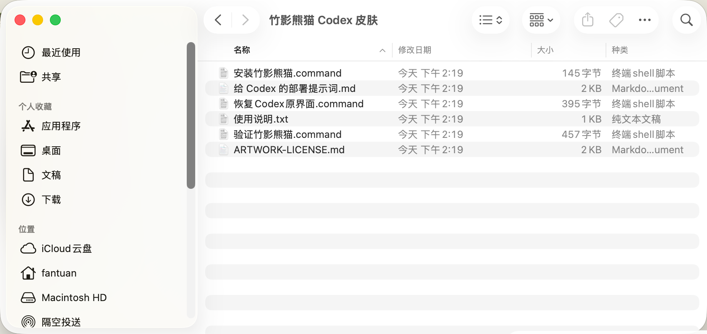

# Codex Skin Lab · 非官方 Codex 皮肤库


给 Codex 桌面端换一种工作氛围。当前公开「竹影熊猫」与「月影灵编」两款免费 Beta，均提供 macOS、Windows 安装包、验证与恢复路径。

> **普通用户请不要点击 `Code → Download ZIP`，也不要下载 Release 页面底部由 GitHub 自动生成的 `Source code (zip / tar.gz)`。** 这些是源码，不是安装包。请直接选择下面与你系统对应的 ZIP。

> 安装前请先阅读[当前 Beta 边界](#当前-beta-边界)与[安全边界](#安全边界)。皮肤需要使用本机调试能力，但不会替你改写 API Key 或 Base URL。

## 直接下载

### 竹影熊猫 Beta 1 · NEW


熊猫、竹影与成都松弛感进入 Codex 工作台。上图为**视觉概念图**，实际效果会随 Codex 版本、系统字体和窗口尺寸略有差异。

| 平台 | 直接下载安装包 | 发布说明 |
| --- | --- | --- |
| macOS | [codex-bamboo-panda-macos-beta1.zip](https://github.com/fantuan-lab/codex-skin-market/releases/download/bamboo-panda-v0.1.0-beta.1/codex-bamboo-panda-macos-beta1.zip) | [Bamboo Panda Beta 1](https://github.com/fantuan-lab/codex-skin-market/releases/tag/bamboo-panda-v0.1.0-beta.1) |
| Windows 10 / 11 | [codex-bamboo-panda-windows-beta1.zip](https://github.com/fantuan-lab/codex-skin-market/releases/download/bamboo-panda-v0.1.0-beta.1/codex-bamboo-panda-windows-beta1.zip) | [Bamboo Panda Beta 1](https://github.com/fantuan-lab/codex-skin-market/releases/tag/bamboo-panda-v0.1.0-beta.1) |

### 月影灵编 Beta 1


| 平台 | 直接下载安装包 | 当前验证状态 |
| --- | --- | --- |
| macOS | [codex-moon-spirit-macos-beta1.zip](https://github.com/fantuan-lab/codex-skin-market/releases/download/v0.1.0-beta.1/codex-moon-spirit-macos-beta1.zip) | 上游测试、隔离安装、客户 ZIP 解压复测与恢复代码检查已通过；最终真实 UI 闭环待验收 |
| Windows 10 / 11 | [codex-moon-spirit-windows-beta1.zip](https://github.com/fantuan-lab/codex-skin-market/releases/download/v0.1.0-beta.1/codex-moon-spirit-windows-beta1.zip) | 脚本语法、安全断言、资源哈希与 ZIP 复测已通过；Windows 10 / 11 真机闭环待验收 |

月影灵编的完整发布说明与 SHA-256 见 [Moon Spirit Beta 1](https://github.com/fantuan-lab/codex-skin-market/releases/tag/v0.1.0-beta.1)。竹影熊猫的校验值与最新验证边界以对应 Release 为准。

## 用户下载后怎么用

下面是 macOS 安装包**完整解压后**的正确目录。看到这些文件，说明解压成功：



> 普通用户只需要使用“安装”“验证”“恢复”三个入口。`给 Codex 的部署提示词.md`、`ARTWORK-LICENSE.md` 和其他说明文件不需要运行。

### macOS

安装前请确认官方 Codex Desktop 已安装并至少启动过一次，建议先退出正在运行的 Codex。

1. 下载 `codex-bamboo-panda-macos-beta1.zip`。
2. 双击 ZIP 完整解压；不要在压缩包预览中运行脚本。
3. 打开解压后的“竹影熊猫 Codex 皮肤”文件夹。
4. 双击 `安装竹影熊猫.command`。终端会自动完成安装；如提示重启 Codex，选择“重启并应用”。
5. 如果 macOS 提示“无法验证开发者”或阻止打开：右键（或按住 Control 点击）`安装竹影熊猫.command`，选择“打开”，再确认“打开”。不要关闭 Gatekeeper。
6. 安装完成后，可双击 `验证竹影熊猫.command` 检查主题是否生效；验证截图会保存到桌面。
7. 不想继续使用时，双击 `恢复Codex原界面.command`，即可移除皮肤并恢复安装前的 Codex 外观。

### Windows 10 / 11

1. 下载 `codex-bamboo-panda-windows-beta1.zip`。
2. 右键 ZIP，选择“全部解压”，再打开最外层文件夹。
3. 双击 `Install Bamboo Panda.cmd` 完成安装。
4. 使用 `Start Bamboo Panda.cmd` 启动皮肤，使用 `Verify Bamboo Panda.cmd` 检查安装结果。
5. 不想继续使用时，双击 `Restore Bamboo Panda.cmd` 恢复 Codex 原界面。
6. 如遇 SmartScreen，请先核对 Release 中的 SHA-256；当前 Beta 尚未进行 Authenticode 签名，不要关闭 SmartScreen。

安装另一款 Codex Skin Lab 皮肤会替换当前活动皮肤，但不会修改 Codex 官方安装包。出现问题时优先运行验证入口，随后可随时恢复官方界面。

Bug 反馈请使用[结构化 Issue 表单](https://github.com/fantuan-lab/codex-skin-market/issues/new?template=bug-report.yml)。不要上传 API Key、Token、Cookie、密码、私人代码或未脱敏日志。

## 当前 Beta 边界

- 两款皮肤均为**免费公开 Beta**，不是已完成双平台签名和全部真机验收的正式商用版。
- macOS 尚未完成面向正式发行的 Developer ID 签名与公证；Windows 尚未完成 Authenticode 签名。
- 每款皮肤的自动化测试、真机测试和恢复闭环状态分别记录在对应 Release；一款皮肤的测试结果不自动代表另一款。
- 竹影熊猫主视觉当前标注为设计目标概念图，不冒充已验收的真实运行截图。
- 项目与 OpenAI、成都相关机构或熊猫保护机构没有隶属、赞助或背书关系。

## 安全边界

主题通过官方 Codex 进程开放的本机 CDP 调试端口注入 CSS 与装饰 DOM：

- **仅限本机回环：** CDP 只绑定 `127.0.0.1`，不会主动监听局域网或公网地址。
- **严格识别进程：** 注入器只连接能够验证为官方 Codex 的回环端口；停止皮肤时会核对已记录的进程路径、PID 与启动时间，身份不符就安全退出，不结束来路不明的本机进程。
- **不修改官方安装：** 不写入或替换 `.app`、`app.asar`、`WindowsApps`、官方可执行文件及其代码签名。
- **不接管原生工作流：** 只注入主题 CSS 与装饰 DOM，不替换 Codex 原生侧栏、项目选择器、任务、建议卡和输入框。
- **不改中转配置：** 不会自动读取、改写或上传 API Key、Token、Base URL；中转服务配置与换肤功能彼此分开。
- **不采集用户内容：** 设计上不采集或上传账号、代码、对话、项目内容及模型配置。
- **可验证、可停止、可恢复：** 安装包同时提供验证与恢复入口；安装前保存活动主题和外观配置，恢复时移除在线皮肤并回到安装前设置。
- **过程公开：** 源码、锁定的上游 commit、许可证、发布说明与 SHA-256 校验值均公开可查。

> **仍然不是零风险：** 这是使用本机调试能力的第三方 Beta 工具。主题运行期间不要启动来源不明的本地程序；安装前请核对 Release 与 SHA-256，并避免在无法接受中断的关键环境中使用。

## 中转站 / Relay Provider 合作

我们开放透明的联名与资源合作：服务商可以提供稳定额度、设备或兼容性测试支持；项目可以提供主题入口、安装教程、联名主题与公开展示位。

所有合作必须披露关系，不把赞助包装成独立评测，也不会通过 Issue 索取任何用户凭据。

[提交公开合作申请 →](https://github.com/fantuan-lab/codex-skin-market/issues/new?template=relay-partnership.yml)

## 仓库结构

```text
app/                                  网站与双皮肤下载落地页
public/skins/                         主题预览素材
codex-skin/bamboo-panda/macos/        竹影熊猫 macOS 源码、安装、验证与恢复
codex-skin/bamboo-panda/windows/      竹影熊猫 Windows 源码、安装、验证与恢复
codex-skin/moon-spirit/macos/         月影灵编 macOS 源码、安装、验证与恢复
codex-skin/moon-spirit/windows/       月影灵编 Windows 源码、安装、验证与恢复
codex-skin/releases/                  发布说明与校验值
codex-skin/UPSTREAM.md                上游 URL、锁定 commit 与许可记录
.github/ISSUE_TEMPLATE/               Bug 与中转站合作表单
```

锁定的上游快照 `codex-skin/vendor/` 仅用于本地审计，不重复提交到本仓库。完整来源见 [`codex-skin/UPSTREAM.md`](./codex-skin/UPSTREAM.md)。

## 本地开发

```bash
npm install
npm run dev
npm run lint
npm run build
```

Node.js 版本要求见 `package.json`。

## 许可与商标

衍生软件代码保留上游 MIT License 与 `NOTICE.md`。原创主题图片按各平台包内 `ARTWORK-LICENSE.md` 的条款处理，不自动转为 MIT。OpenAI、Codex 及其标识属于各自权利人；本项目未获得 OpenAI 官方授权或背书。
